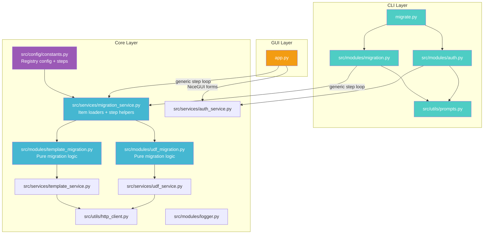
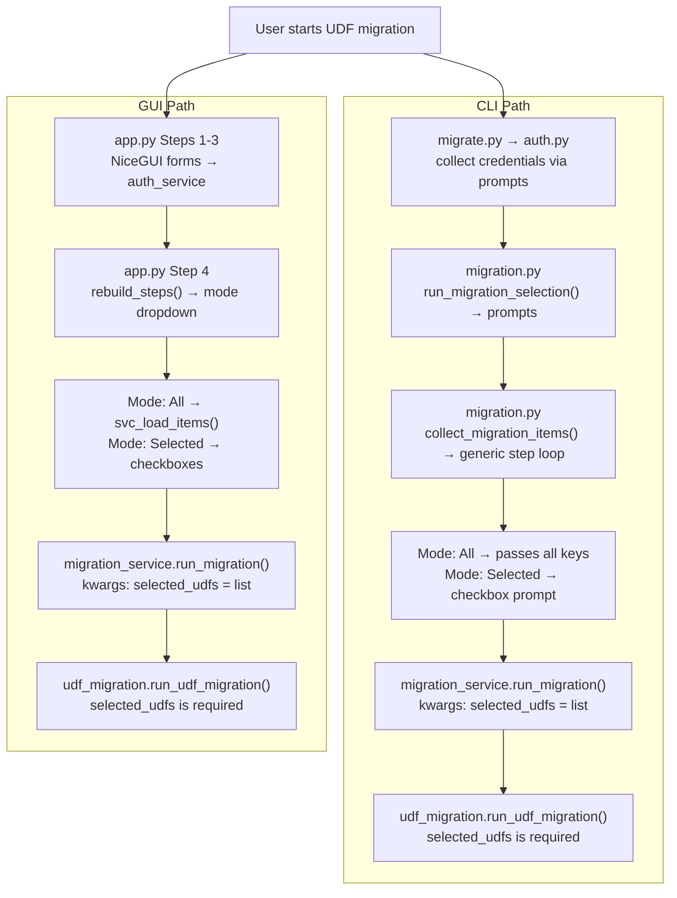
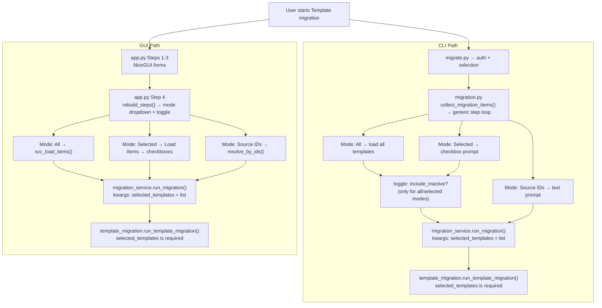

# SDP Migration Wizard — Architecture Guide

## Three-Layer Architecture

The codebase is split into three independent layers. CLI and GUI are thin wrappers — all business logic lives in Core.



---

## File Ownership

| Layer | Files | Purpose |
|-------|-------|---------|
| **CLI** | [migrate.py](file:///Users/harish-7052/Work/Workspace/Presales_scripts/migrate.py), [run.sh](file:///Users/harish-7052/Work/Workspace/Presales_scripts/run.sh), [src/modules/auth.py](file:///Users/harish-7052/Work/Workspace/Presales_scripts/src/modules/auth.py), [src/modules/migration.py](file:///Users/harish-7052/Work/Workspace/Presales_scripts/src/modules/migration.py), [src/utils/prompts.py](file:///Users/harish-7052/Work/Workspace/Presales_scripts/src/utils/prompts.py) | Terminal prompts via `questionary` |
| **GUI** | [app.py](file:///Users/harish-7052/Work/Workspace/Presales_scripts/app.py), [run_ui.sh](file:///Users/harish-7052/Work/Workspace/Presales_scripts/run_ui.sh), [requirements-ui.txt](file:///Users/harish-7052/Work/Workspace/Presales_scripts/requirements-ui.txt) | Web UI via `NiceGUI` |
| **Core** | `src/services/*`, [src/modules/udf_migration.py](file:///Users/harish-7052/Work/Workspace/Presales_scripts/src/modules/udf_migration.py), [src/modules/template_migration.py](file:///Users/harish-7052/Work/Workspace/Presales_scripts/src/modules/template_migration.py), [src/utils/http_client.py](file:///Users/harish-7052/Work/Workspace/Presales_scripts/src/utils/http_client.py), [src/modules/logger.py](file:///Users/harish-7052/Work/Workspace/Presales_scripts/src/modules/logger.py), `src/config/*` | Business logic, config, HTTP |

> [!IMPORTANT]
> Handlers ([udf_migration.py](file:///Users/harish-7052/Work/Workspace/Presales_scripts/src/modules/udf_migration.py), [template_migration.py](file:///Users/harish-7052/Work/Workspace/Presales_scripts/src/modules/template_migration.py)) have **zero CLI/GUI imports**. They accept data and execute — no prompts, no UI widgets.

---

## Registry Config System

All migration types are declared in [constants.py](file:///Users/harish-7052/Work/Workspace/Presales_scripts/src/config/constants.py) → `SUPPORTED_MIGRATIONS`. Each type has a [steps](file:///Users/harish-7052/Work/Workspace/Presales_scripts/src/services/migration_service.py#113-117) list that drives **both** CLI and GUI generically.

### Step Types

| Type | Key Fields | CLI Widget | GUI Widget |
|------|-----------|------------|------------|
| [item_selection](file:///Users/harish-7052/Work/Workspace/Presales_scripts/src/modules/migration.py#101-151) | `modes`, `item_loader`, `item_key`, `item_label` | [select()](file:///Users/harish-7052/Work/Workspace/Presales_scripts/src/utils/prompts.py#13-24) → [checkbox()](file:///Users/harish-7052/Work/Workspace/Presales_scripts/src/utils/prompts.py#43-57) | `ui.select()` → Load Items → checkboxes |
| [toggle](file:///Users/harish-7052/Work/Workspace/Presales_scripts/app.py#754-762) | `label`, [default](file:///Users/harish-7052/Work/Workspace/Presales_scripts/src/modules/template_migration.py#288-307) | [confirm()](file:///Users/harish-7052/Work/Workspace/Presales_scripts/src/utils/prompts.py#6-11) | `ui.switch()` |
| `text_input` | `label` | [text()](file:///Users/harish-7052/Work/Workspace/Presales_scripts/src/utils/prompts.py#26-34) | `ui.input()` |

### Conditional Steps

Steps can have a [condition](file:///Users/harish-7052/Work/Workspace/Presales_scripts/app.py#462-469) dict to control visibility:

```python
"condition": {"mode_in": ["all", "selected"]}   # show only for these modes
"condition": {"module_in": ["service_request"]}  # show only for these modules
```

Conditions are evaluated by [should_show_step()](file:///Users/harish-7052/Work/Workspace/Presales_scripts/src/services/migration_service.py#119-140) in [migration_service.py](file:///Users/harish-7052/Work/Workspace/Presales_scripts/src/services/migration_service.py).

### Item Loaders

`ITEM_LOADERS` in [migration_service.py](file:///Users/harish-7052/Work/Workspace/Presales_scripts/src/services/migration_service.py) maps loader keys to fetch functions:

| Key | Function | Returns |
|-----|----------|---------|
| `load_udfs` | [_load_udf_items()](file:///Users/harish-7052/Work/Workspace/Presales_scripts/src/services/migration_service.py#33-39) → [get_udf_context()](file:///Users/harish-7052/Work/Workspace/Presales_scripts/src/services/udf_service.py#11-67) | UDF dicts with [key](file:///Users/harish-7052/Work/Workspace/Presales_scripts/src/modules/template_migration.py#321-359), `display_name`, `field_type` |
| `load_templates` | [_load_template_items()](file:///Users/harish-7052/Work/Workspace/Presales_scripts/src/services/migration_service.py#41-48) → [fetch_all_templates()](file:///Users/harish-7052/Work/Workspace/Presales_scripts/src/services/template_service.py#22-38) | Template dicts with [id](file:///Users/harish-7052/Work/Workspace/Presales_scripts/src/modules/auth.py#18-25), `name` |

### Current Config

```python
SUPPORTED_MIGRATIONS = {
    "udf": {
        "steps": [
            {type: "item_selection", modes: ["all", "selected"], item_loader: "load_udfs"},
        ],
    },
    "template": {
        "steps": [
            {type: "item_selection", modes: ["all", "selected", "source_ids"], item_loader: "load_templates"},
            {type: "toggle", key: "include_inactive", condition: {mode_in: ["all", "selected"]}},
        ],
    },
}
```

---

## Control Flow — UDF Migration



## Control Flow — Template Migration



---

## How to Add a New Migration Type

1. **Add handler** in `src/modules/` (e.g. `workflow_migration.py`) — pure logic, accepts selections as required params
2. **Register handler** in `migration_service.py` → `MIGRATION_HANDLERS`
3. **Add item loader** in `migration_service.py` → `ITEM_LOADERS` (if it needs item selection)
4. **Add config** in `constants.py` → `SUPPORTED_MIGRATIONS` with `steps` list

**Zero changes to CLI or GUI code.** Both iterate steps generically.

### Example: Adding sub-components to Template

To add toggles like "Migrate Template Tasks", "Migrate Checklist", "Resource Config (service templates only)":

```python
"template": {
    "steps": [
        {type: "item_selection", ...},        # existing
        {type: "toggle", key: "include_inactive", ...},  # existing
        # NEW — just add these:
        {type: "toggle", key: "template_tasks", label: "Migrate Template Tasks", default: True},
        {type: "toggle", key: "checklist", label: "Migrate Checklist", default: True},
        {
            type: "toggle", key: "resource_config",
            label: "Migrate Resource Configuration", default: True,
            condition: {"module_in": ["service_request"]},
        },
    ],
}
```

CLI auto-renders `confirm()` prompts. GUI auto-renders `ui.switch()` widgets. Handler receives them as kwargs.
